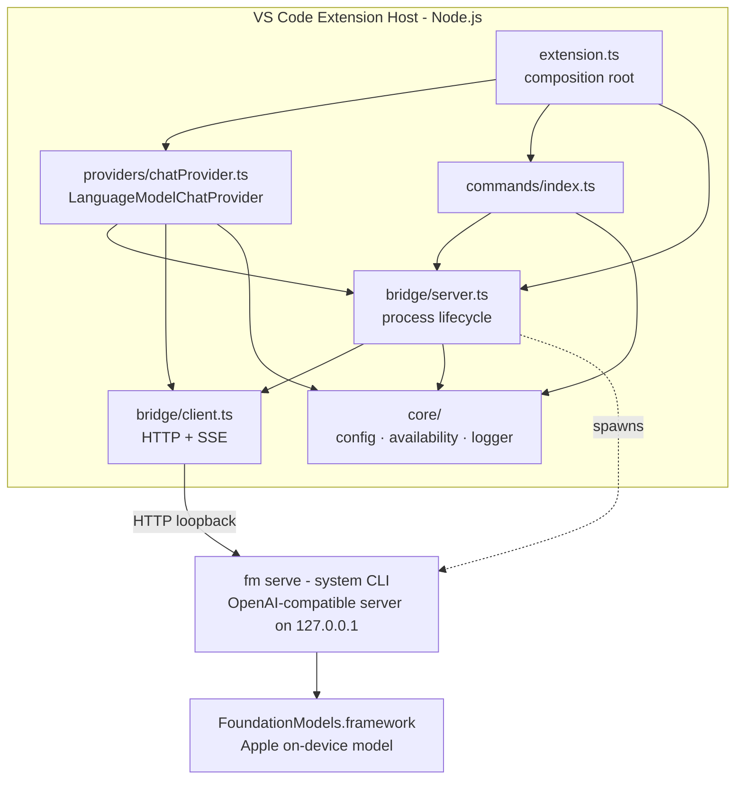

# Architecture

This document explains how the extension is put together and why. Decisions with real
alternatives are recorded as ADRs in [docs/adr/](docs/adr/); this file is the map.

## System overview

## Why this shape

**The central constraint:** VS Code extensions run in Node.js; Apple's `FoundationModels`
framework is only callable from Swift (or the new Python SDK). Some native bridge is
unavoidable. We use the `fm` CLI preinstalled on macOS 27+ as that bridge, with the community
`afm` CLI as the macOS 26 fallback ([ADR-0002](docs/adr/0002-bridge-cli.md)): both expose the
framework as an OpenAI-compatible HTTP server bound to loopback, which gives us a stable,
well-understood wire protocol and keeps this repository 100% TypeScript.

**The central integration choice:** we contribute a model, not a chat UI. VS Code's stable
Language Model Chat Provider API puts "Apple On-Device" into the native model picker, so users
keep the chat interface they already know ([ADR-0003](docs/adr/0003-language-model-chat-provider.md)).

## Module responsibilities

| Module | Responsibility | May import |
| --- | --- | --- |
| `src/extension.ts` | Composition root: wire dependencies, register disposables | everything |
| `src/providers/` | Adapt VS Code's LM provider API to the bridge | `bridge`, `core` |
| `src/commands/` | User-facing commands (status, restart, logs, manage) | `bridge`, `core` |
| `src/bridge/` | Talk to / manage the bridge process. No VS Code UI imports | `core` types only |
| `src/core/` | Config, logging, host availability. Leaf modules | nothing internal |
| `src/test/` | Unit tests + `vscode` stub | anything |

Dependency direction is strictly downward (`extension → providers/commands → bridge → core`).
There are no cycles, and `bridge`/`core` logic is written as pure functions or thin classes so
it is unit-testable without an editor.

## Key flows

### Chat request

1. User picks "Apple On-Device" and sends a message.
2. VS Code calls `provideLanguageModelChatResponse`.
3. Provider asks `BridgeServerManager.ensureRunning()` — health check on the configured port;
   if unhealthy and `autoStart` is on, spawn `fm serve --port <port>` (or `afm -p <port>`,
   derived from the executable name) and poll `/v1/models` until ready.
4. `BridgeClient.streamChat` POSTs to `/v1/chat/completions` (`stream: true`) and parses SSE
   frames incrementally; the wire model id is resolved from `/v1/models` (preferring `system`).
5. Each text delta is reported as a `LanguageModelTextPart`; cancellation flows from VS Code's
   `CancellationToken` into an `AbortController` that tears down the HTTP stream.

### Availability gating

`provideLanguageModelChatInformation` returns an empty model list unless the host passes
`checkHost`: macOS (`darwin`), Apple Silicon (`arm64`), Darwin kernel ≥ 25 (macOS 26 Tahoe).
This keeps the model out of the picker on unsupported machines instead of failing at request time.

### Process ownership

The manager only kills processes it spawned. If a user runs `fm serve` (or `afm`) themselves,
the health check finds it and the extension becomes a pure client — restarts and disposal leave
the user's process alone.

## Error handling philosophy

- Every failure the user can act on surfaces a actionable message (install command, setting name,
  System Settings location).
- Everything else goes to the `Apple Foundation Models` log output channel at an appropriate
  level; the channel is one command away (`Show Logs`).
- Cancellation is not an error: cancelled requests end quietly.

## Security posture (summary)

- Bridge binds to `127.0.0.1` only; the extension never opens a listening socket itself.
- No telemetry, no analytics, no network calls on the inference path.
- The only spawned executable is the user-configured bridge path (default `/usr/bin/fm`) —
  never shell-interpolated (spawn with an args array, `shell: false` default).

Full policy: [SECURITY.md](SECURITY.md).

## Decision log

| ADR | Decision |
| --- | --- |
| [0001](docs/adr/0001-macos-only-on-device-scope.md) | macOS-only, on-device-only scope |
| [0002](docs/adr/0002-bridge-cli.md) | Bridge via the system `fm` CLI (with `afm` fallback) |
| [0003](docs/adr/0003-language-model-chat-provider.md) | Integrate via Language Model Chat Provider API |
| [0004](docs/adr/0004-toolchain.md) | pnpm + Biome + esbuild + Vitest toolchain |
| [0005](docs/adr/0005-release-automation.md) | Changesets + GitHub Actions release automation |
