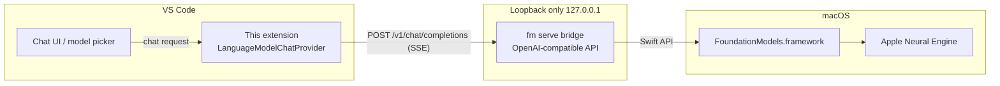

# Apple Foundation Models for VS Code

> Private, offline AI-assisted development powered by Apple's on-device Foundation Models.

[](https://github.com/AwaleSagar/apple-foundation-vscode/actions/workflows/ci.yml)
[](https://github.com/AwaleSagar/apple-foundation-vscode/actions/workflows/codeql.yml)
[](LICENSE)
[-black?logo=apple)](#requirements)
[](https://www.conventionalcommits.org)
[](https://github.com/changesets/changesets)

---

## Vision

Every keystroke of AI assistance should be able to happen **on your machine**. This extension
contributes Apple's on-device Foundation Model (the model behind Apple Intelligence) to VS Code's
chat model picker, so you can use AI chat in your editor with:

- **Privacy** — prompts and code never leave your Mac. No accounts, no API keys, no telemetry.
- **Offline** — works on a plane, on a train, behind an air-gapped network.
- **Zero cost** — inference runs on the Apple Neural Engine you already own.
- **Native** — built specifically for macOS; no cross-platform lowest common denominator.

## How it works



The extension registers a [Language Model Chat Provider](https://code.visualstudio.com/api/extension-guides/ai/language-model-chat-provider)
so "Apple On-Device" appears in VS Code's chat model dropdown. Requests are streamed to a
loopback bridge server — by default the `fm` CLI preinstalled on macOS 27+ (`fm serve`), which
exposes Apple's `FoundationModels` framework through an OpenAI-compatible server on `127.0.0.1`.
On macOS 26, the community [`afm`](https://github.com/scouzi1966/maclocal-api) CLI serves the
same role. The extension manages the bridge process lifecycle for you. See
[ARCHITECTURE.md](ARCHITECTURE.md) for the full picture and [docs/adr/](docs/adr/) for why each
piece was chosen.

## Features

- 🧠 **Native chat model** — "Apple On-Device" in the VS Code chat model picker
- 🔌 **Automatic bridge management** — starts, monitors, and restarts the bridge server; reuses
  an already-running server without taking it over
- 🍎 **Zero-install on macOS 27+** — uses the system `fm` CLI; no Homebrew required
- 📡 **Streaming responses** — token-by-token output via Server-Sent Events
- 🩺 **Status & diagnostics** — `Apple Foundation Models: Show Status` command and a dedicated
  log output channel
- 🔒 **Loopback-only by design** — no network egress on the inference path, enforced in code review
  and CI culture (see [SECURITY.md](SECURITY.md))

### Screenshots

> 🚧 Placeholders — replace once the UI stabilizes.

| Model picker | Chat streaming | Status command |
| --- | --- | --- |
|  |  |  |

## Requirements

| Requirement | Why |
| --- | --- |
| macOS 26 (Tahoe) or later | The `FoundationModels` framework ships with macOS 26 |
| Apple Silicon (M1 or later) | On-device model runs on the Apple Neural Engine |
| Apple Intelligence enabled | System Settings → Apple Intelligence & Siri |
| VS Code ≥ 1.104 | Stable Language Model Chat Provider API |
| Bridge CLI | macOS 27+: the preinstalled `fm` CLI (nothing to do). macOS 26: [`afm`](https://github.com/scouzi1966/maclocal-api) |

## Installation

1. **macOS 27+**: nothing to install — the system `fm` CLI is the bridge.
   **macOS 26 only**: install the fallback bridge and point
   `appleFoundation.bridge.executablePath` at it:

   ```sh
   brew install scouzi1966/afm/afm
   ```

2. Install the extension:
   - **Marketplace** (once published): search "Apple Foundation Models"
   - **VSIX**: download from [Releases](https://github.com/AwaleSagar/apple-foundation-vscode/releases),
     then `code --install-extension apple-foundation-vscode-*.vsix`

3. Open VS Code chat, click the model picker, and choose **Apple On-Device**.

## Configuration

| Setting | Default | Description |
| --- | --- | --- |
| `appleFoundation.bridge.executablePath` | `fm` | Path to the bridge CLI (`afm` on macOS 26) |
| `appleFoundation.bridge.port` | `9999` | Loopback port for the bridge server |
| `appleFoundation.bridge.autoStart` | `true` | Start the bridge on demand |
| `appleFoundation.model.maxOutputTokens` | `1024` | Response token cap (context is 4096 shared) |

## Development setup

```sh
# Prerequisites: Node 24 (see .node-version), pnpm 11 (corepack enable)
git clone https://github.com/AwaleSagar/apple-foundation-vscode.git
cd apple-foundation-vscode
pnpm install
pnpm run verify        # lint + typecheck + tests
```

Press **F5** in VS Code to launch an Extension Development Host with the extension loaded.
Full guide: [DEVELOPMENT.md](DEVELOPMENT.md).

### Common scripts

| Command | What it does |
| --- | --- |
| `pnpm run watch` | Incremental esbuild bundle for F5 debugging |
| `pnpm run check` / `check:fix` | Biome lint + format |
| `pnpm run typecheck` | Strict TypeScript, no emit |
| `pnpm run test` / `test:watch` | Vitest unit tests |
| `pnpm run build` | Production bundle to `dist/` |
| `pnpm run package` | Build a `darwin-arm64` VSIX |

## Testing

Unit tests (Vitest) cover all pure logic — SSE parsing, host availability, config normalization,
message conversion — with the `vscode` module aliased to a stub. Editor-integration behavior is
verified in the Extension Development Host. Strategy and rationale:
[docs/testing-strategy.md](docs/testing-strategy.md).

## Debugging

- **F5** launches the Extension Development Host (esbuild watch task runs automatically).
- Run **Apple Foundation Models: Show Logs** for the extension + bridge output channel.
- Bridge won't start? Check `lsof -i :9999`, try `fm serve --port 8080` manually, confirm Apple
  Intelligence is enabled (`fm available`). More in the [Troubleshooting](#troubleshooting) section.

## Packaging & publishing

- `pnpm run package` produces a platform-specific VSIX (`--target darwin-arm64`) — this extension
  is intentionally not published for other platforms.
- Releases are automated: merged changesets → release PR → tag → VSIX attached to the GitHub
  Release. Marketplace publishing is a deliberate manual gate for now.
  Details: [docs/release-process.md](docs/release-process.md).

## Contributing

Contributions are welcome! Start with [CONTRIBUTING.md](CONTRIBUTING.md); it covers the
branching model, Conventional Commits, changesets, and review expectations.
AI-assisted contributions are explicitly supported — see
[docs/ai-collaboration.md](docs/ai-collaboration.md).

## Roadmap

Highlights (full plan in [ROADMAP.md](ROADMAP.md)):

- **v0.x** — chat provider, bridge lifecycle, diagnostics
- **v1.0** — Marketplace release, inline completion experiment, status bar UI
- **Later** — tool calling, guided-generation structured outputs, opt-in Private Cloud Compute
  model, optional embedded Swift sidecar for deeper framework access

## FAQ

**Why macOS only?** The `FoundationModels` framework only exists on Apple platforms; faking
portability would compromise the core promise. See
[ADR-0001](docs/adr/0001-macos-only-on-device-scope.md).

**Does anything leave my machine?** No. The extension talks only to `127.0.0.1`. The `afm`
bridge and Apple's on-device model make no network calls for inference.

**Why a bridge process at all?** VS Code extensions run in Node; Apple's framework is
Swift-only. On macOS 27+ the preinstalled `fm serve` is that bridge (zero install); on macOS 26
the Homebrew `afm` CLI fills the same role. See [ADR-0002](docs/adr/0002-bridge-cli.md).

**Is the model as good as cloud models?** No — it's a ~3B-parameter on-device model with a
4096-token context. It's excellent for quick, private assistance; it will not replace a frontier
model for complex tasks.

**Can I use it with Copilot Chat?** Yes. The model appears in the standard model picker via the
Language Model Chat Provider API ("bring your own model").

## Troubleshooting

| Symptom | Fix |
| --- | --- |
| Model missing from picker | Confirm macOS 26+, Apple Silicon, Apple Intelligence enabled |
| "Bridge executable not found" | macOS 27+: check `which fm`. macOS 26: `brew install scouzi1966/afm/afm` and set `appleFoundation.bridge.executablePath` |
| Bridge won't start | Port busy? `lsof -i :9999`; change `appleFoundation.bridge.port`. Check `fm available` |
| Empty/failed responses | Run `fm respond "hello"` in a terminal to verify the model works at all |
| Still stuck | Run **Show Logs**, then [open an issue](https://github.com/AwaleSagar/apple-foundation-vscode/issues) with the output |

## Acknowledgements

- Apple's [Foundation Models framework](https://developer.apple.com/documentation/foundationmodels)
  and the `fm` CLI introduced at WWDC26
- [scouzi1966/maclocal-api](https://github.com/scouzi1966/maclocal-api) — the `afm` bridge CLI
  used as the macOS 26 fallback
- The VS Code team for the [Language Model Chat Provider API](https://code.visualstudio.com/api/extension-guides/ai/language-model-chat-provider)

## License

[MIT](LICENSE) © Sagar Awale
