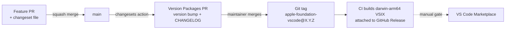

# Release process

Releases are automated with [Changesets](https://github.com/changesets/changesets) and GitHub
Actions. Rationale: [ADR-0005](adr/0005-release-automation.md).

## How a change becomes a release

1. **Contributor** adds a changeset (`pnpm changeset`) in the feature PR describing the semver
   impact (`patch`/`minor`/`major`) and user-facing notes.
2. On merge to `main`, the release workflow runs `pnpm run verify`, then the Changesets action
   creates or updates a **"Version Packages" PR** that accumulates pending changesets, bumps
   `package.json`, and rewrites `CHANGELOG.md`.
3. **A maintainer merges the Version Packages PR** — this is the release decision. The workflow
   tags `apple-foundation-vscode@X.Y.Z`, packages the VSIX, and uploads it to the GitHub Release.
4. **Marketplace publish** is currently a manual step (commented out in
   `.github/workflows/release.yml`) until the publisher account and `VSCE_PAT` secret are
   provisioned. To enable: create the publisher, add the secret, uncomment the step.

## Versioning policy

- Semver from the user's perspective: settings, commands, and visible behavior are the API.
- Pre-1.0, breaking changes bump minor (standard semver 0.x rules); we still write migration
  notes in the changeset.

## Hotfixes

Same pipeline — a `fix/` branch with a `patch` changeset, merged twice (feature PR, then Version
Packages PR). No separate hotfix track; keeping one path keeps it reliable.

## Release checklist (maintainer)

- [ ] CI green on `main`
- [ ] Manual test checklist from [testing-strategy.md](testing-strategy.md) run on real hardware
- [ ] Version Packages PR changelog reads like something a user would want to read
- [ ] After merge: GitHub Release has the VSIX attached and installs cleanly
      (`code --install-extension`)
